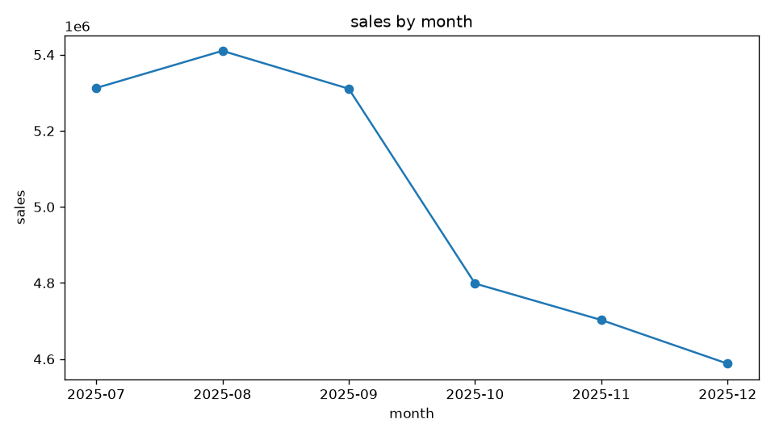
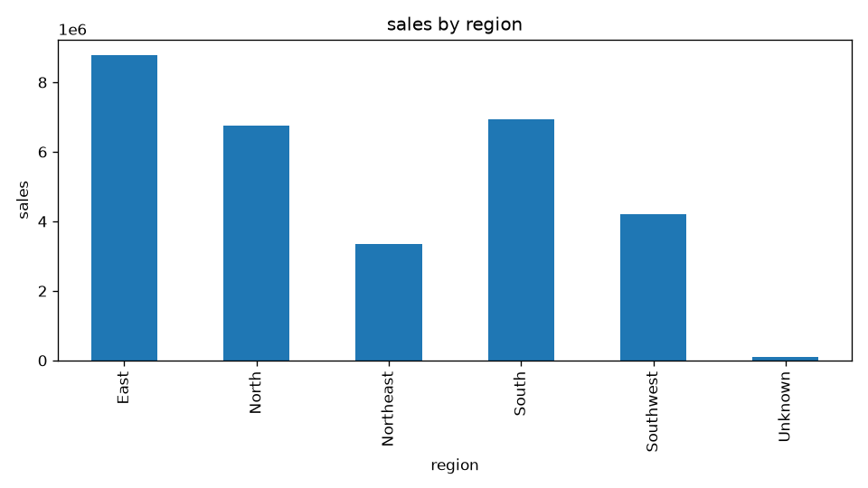

# Sales Data Analysis Agent

An LLM agent that answers questions about a sales CSV by calling predefined
Python tools. The model chooses tools and explains results; **all numeric
computation is done by pandas**, not by the model.

## Features
- Fixed-schema CSV loading with column / type / missing-value validation
- 5 tools: `inspect_data`, `group_stats`, `time_trend`, `compare_periods`, `plot`
- Multi-step tool calling with a max-step guard and error feedback to the model
- Model fallback (Gemini) when the primary model is overloaded
- Every run saved as JSON: question, tool calls, results, answer, models used

## Quick start
```bash
git clone https://github.com/<your-name>/sales-agent.git
cd sales-agent
python -m venv .venv && source .venv/bin/activate
pip install -r requirements.txt
cp .env.example .env        # then put your Gemini API key in .env
python ask.py "Which product has the highest sales?"
python ask.py "Which regions contributed most to the sales decline this month?"
```

## Example
**Q:** Which regions contributed most to the sales decline this month?

Tool calls: `inspect_data()` → `compare_periods("2025-11", "2025-12", "region")`

**A:** South (-329,312.60, 58.84% of the decline) and East (-230,362.78, 41.16%)
drove the drop, partly offset by growth in North, Northeast and Southwest (+415,823.67).

## Project structure
| File | Purpose |
|---|---|
| `make_data.py` | Generates the synthetic dataset (run once; data is frozen) |
| `data/sales_frozen.csv` | Frozen dataset used for all tests and evaluation |
| `data_layer.py` | CSV loading and validation |
| `tools.py` | The 5 analysis tools |
| `schemas.py` | Tool JSON schemas and dispatch table |
| `agent_core.py` | Agent loop, system prompt, run logging |
| `llm_gemini.py` | Gemini adapter with retry and model fallback |
| `ask.py` | Command-line entry point |

## Evaluation

The agent was evaluated on a benchmark of 10 representative sales-analysis queries covering aggregation, period comparison, contribution analysis, time-series analysis, cross-region comparison, and visualization.

Each query was evaluated on four criteria:

- **Tool selection** — whether the agent selected the appropriate analysis tool.
- **Argument correctness** — whether the generated tool arguments matched the user request.
- **Execution** — whether the tool call completed successfully.
- **Final answer correctness** — whether the final response was consistent with the underlying data and tool output.

### Results

| # | Evaluation Query | Tool(s) Used | Result |
|---|---|---|---|
| 1 | What is the total sales in December 2025? | `inspect_data`, `group_stats` | PASS |
| 2 | Which region had the highest total sales? | `group_stats` | PASS |
| 3 | Which product had the lowest total sales? | `group_stats` | PASS |
| 4 | How did total sales change from November to December 2025? | `compare_periods` | PASS |
| 5 | Which regions contributed most to the sales decline in December 2025 compared with November? | `inspect_data`, `compare_periods` | PASS |
| 6 | Which products contributed most to the sales decline in December 2025 compared with November? | `inspect_data`, `compare_periods` | PASS |
| 7 | What was the monthly sales trend from July to December 2025? | `time_trend` | PASS |
| 8 | Compare the sales performance of East and South. | `inspect_data`, `group_stats` | PASS |
| 9 | Plot monthly sales as a line chart. | `plot` | PASS |
| 10 | Plot total sales by region as a bar chart. | `plot` | PASS |

**Overall result: 10/10 evaluation queries passed.**

### Evaluation-driven bug fix

The evaluation uncovered a data-consistency issue in region-level analysis. Pandas `groupby()` drops missing grouping values by default, causing records with missing region information to be excluded from regional aggregates. As a result, region-level period comparisons did not initially reconcile with the overall sales totals.

The aggregation pipeline was updated to preserve missing grouping values as an `Unknown` category across `group_stats`, `compare_periods`, and `plot`.

After the fix, grouped results reconcile with the overall totals. For example, sales from November to December 2025 changed by:

- November: `$4,702,643.42`
- December: `$4,587,847.10`
- Net change: `-$114,796.32`

The affected evaluation cases were rerun successfully after the fix.

## Example Outputs

The agent can generate visualizations directly from natural-language requests using the deterministic `plot` tool.

### Monthly Sales Trend

**Query:**

> Plot monthly sales as a line chart.



### Sales by Region

**Query:**

> Plot total sales by region as a bar chart.



## Notes
Data is synthetic. Model names change often; edit `MODELS` in `llm_gemini.py`.